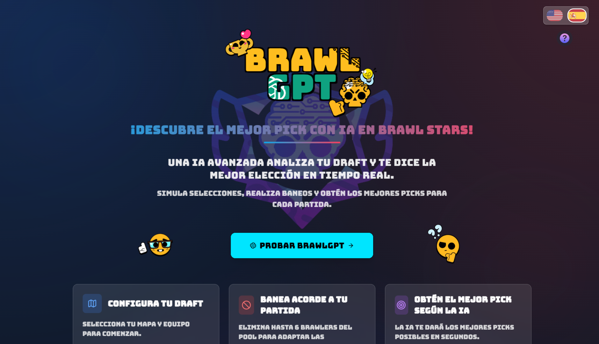
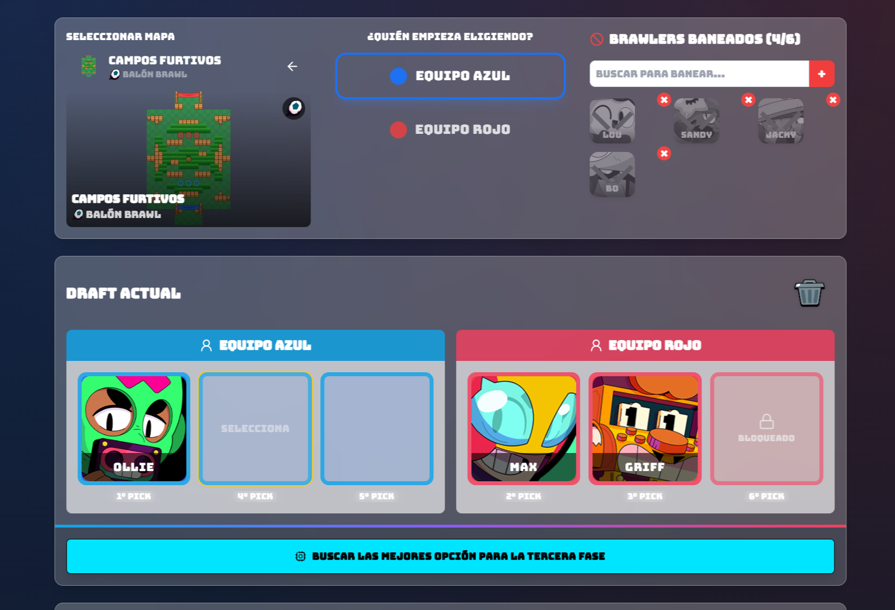
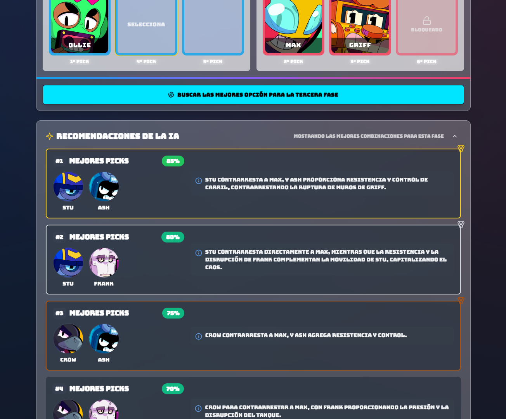
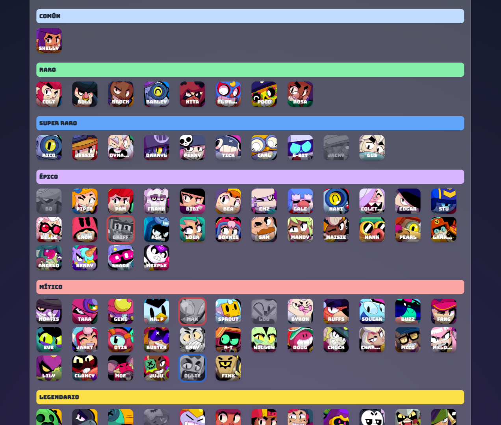

<p align="center">

</p>

<h1 align="center">BrawlGPT</h1>

<p align="center">
Competitive Brawl Stars drafting assistant powered by Google Gemini.
</p>

<p align="center">
  <a href="https://brawl-gpt.vercel.app/"></a>
  &nbsp;
  <a href="https://brawlgpt-backend-762078704585.europe-west1.run.app/docs"></a>
</p>

<p align="center">
  
  
  
  
  
  
  
</p>

---

## Overview

BrawlGPT analyzes the current state of a competitive Brawl Stars draft (map, bans and team picks) and generates recommendations for each draft phase.

The application consists of two independent components:

- **Frontend** — React + TypeScript single-page application featuring drag-and-drop interactions, internationalization (English and Spanish), light/dark themes, and a game-inspired interface.
- **API** — FastAPI service that builds phase-specific prompts and communicates with Google Gemini using a strict `response_schema` to guarantee validated and structured JSON responses.

---

## Key Features

- Real-time draft recommendations for all draft phases.
- Structured Gemini outputs validated through Pydantic schemas.
- Explanations available in both English and Spanish.
- Interactive React frontend with drag-and-drop support.
- FastAPI backend designed around a simple JSON API.

---

## Demo

<table>
  <tr>
    <td></td>
    <td></td>
  </tr>
  <tr>
    <td></td>
    <td></td>
  </tr>
</table>

---

## How It Works

```text
Frontend (React)
   │  POST /draft { phase, map, team, banned, picks }
   ▼
API (FastAPI)
   │  Build draft context
   │  Generate phase-specific instructions
   │  Request recommendations from Gemini
   ▼
Structured JSON response
```

Each draft phase is processed independently. Gemini only receives the information required to make recommendations, including the selected map, available brawlers, relevant counters, and current picks.

---

## Project Structure

```text
brawlgpt/
├── frontend/   React + Vite + TypeScript + Tailwind
└── backend/    FastAPI + Pydantic v2 + Google Gemini
```

Additional implementation details can be found in:

- frontend/README.md
- backend/README.md

---

## Tech Stack

| Layer | Technologies |
|---------|---------|
| Frontend | React 18, TypeScript, Vite, Tailwind, shadcn/ui, i18next |
| Backend | Python 3.11, FastAPI, Pydantic v2, Google Gemini |
| Deployment | Render (static frontend + containerized API) |

---

## API Example

```http
POST /draft
{
  "phase": 2,
  "selected_map": "Hard Rock Mine",
  "banned_brawlers": ["Spike", "Crow", "Rico"],
  "team": "blue",
  "picks": ["Brock"]
}
```

```json
{
  "gemini_suggestions": [
    {
      "brawlers": "Maisie + Stu",
      "probability": 75,
      "explanationUSA": "Stu's mobility fits the lanes and Maisie keeps constant pressure.",
      "explanationESP": "La movilidad de Stu encaja con el mapa y Maisie aporta presión constante."
    }
  ]
}
```

---

<div align="center">
  <sub>
    Developed by <strong>Víctor Díez</strong>. This project is not affiliated with Supercell. Brawl Stars and related assets are property of Supercell.
  </sub>
</div>
