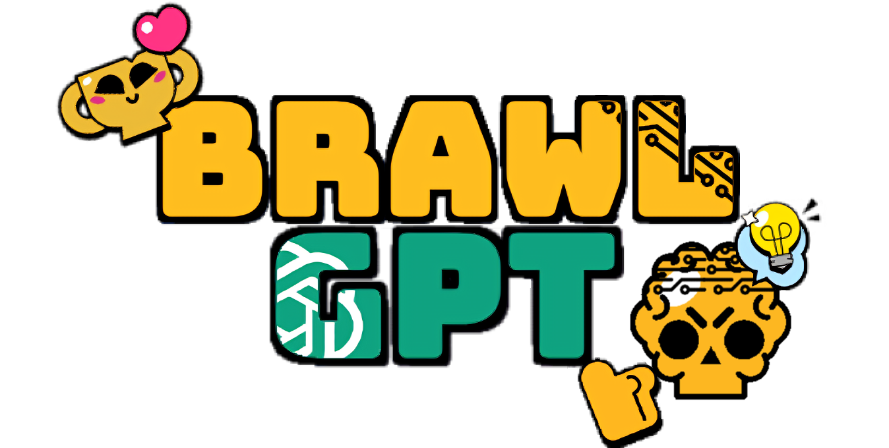

<div align="center">
  

  <h1>BrawlGPT</h1>

  <p><strong>Asistente de drafts para Brawl Stars competitivo con recomendaciones generadas por IA.</strong></p>

<p>
  <a href="https://brawl-gpt.vercel.app/">
    
  </a>
  <a href="https://brawlgpt-backend-762078704585.europe-west1.run.app/docs">
    
  </a>
</p>

  <p>
    
    
    
    
    
    
  </p>
</div>

---

## Qué es

BrawlGPT analiza el estado de un draft de Brawl Stars (mapa, baneos, picks por equipo) y devuelve, en cada una de las 4 fases del draft, las mejores combinaciones de brawlers con una explicación en español e inglés.

Está formado por dos piezas independientes:

- **Frontend** — SPA en React + TypeScript con drag & drop, i18n (es/en), tema claro/oscuro y diseño inspirado en la estética del juego.
- **API** — Servicio en FastAPI que construye el payload por fase y lo envía a **Google Gemini** con un `response_schema` estricto que garantiza respuestas JSON validadas.

## Demo

<table>
  <tr>
    <td></td>
    <td></td>
  </tr>
  <tr>
    <td></td>
    <td></td>
  </tr>
</table>

## Cómo funciona

```
Frontend (React)
   │  POST /draft { phase, map, team, banned, picks }
   ▼
API (FastAPI)
   │  build_user_message()        → JSON con el estado mínimo del draft
   │  build_system_instruction()  → reglas específicas de la fase (1-4)
   │  call_gemini()               → llamada con response_schema
   ▼
{ gemini_suggestions: [ { brawlers, probability, explanationESP, explanationUSA } ] }
```

Cada fase se envía a Gemini de forma autocontenida: solo recibe lo accionable (mapa, brawlers disponibles, counters relevantes y picks ya realizados).

## Estructura

```
brawlgpt/
├── frontend/   React + Vite + TypeScript + Tailwind
└── backend/    FastAPI + Pydantic v2 + Google Gemini
```

Cada subproyecto tiene su propio README con detalles técnicos y de despliegue:

- [frontend/README.md](frontend/README.md)
- [backend/README.md](backend/README.md)

## Stack

| Capa     | Tecnologías                                              |
| -------- | -------------------------------------------------------- |
| Frontend | React 18, TypeScript, Vite, Tailwind, shadcn/ui, i18next |
| API      | Python 3.11, FastAPI, Pydantic v2, google-genai (Gemini) |
| Deploy   | Render (frontend estático + API en contenedor)           |

## Ejemplo de llamada

```http
POST /draft
{
  "phase": 2,
  "selected_map": "Hard Rock Mine",
  "banned_brawlers": ["Spike", "Crow", "Rico"],
  "team": "blue",
  "picks": ["Brock"]
}
```

```json
{
  "gemini_suggestions": [
    {
      "brawlers": "Maisie + Stu",
      "probability": 75,
      "explanationUSA": "Stu's mobility fits the lanes and Maisie keeps constant pressure.",
      "explanationESP": "La movilidad de Stu encaja con el mapa y Maisie aporta presión constante."
    }
  ]
}
```

---

<div align="center">
  <sub>Desarrollado por <strong>Víctor Díez</strong> · Proyecto no afiliado a Supercell. Brawl Stars y sus activos pertenecen a Supercell — ver <a href="https://supercell.com/en/fan-content-policy/">Fan Content Policy</a>.</sub>
</div>
